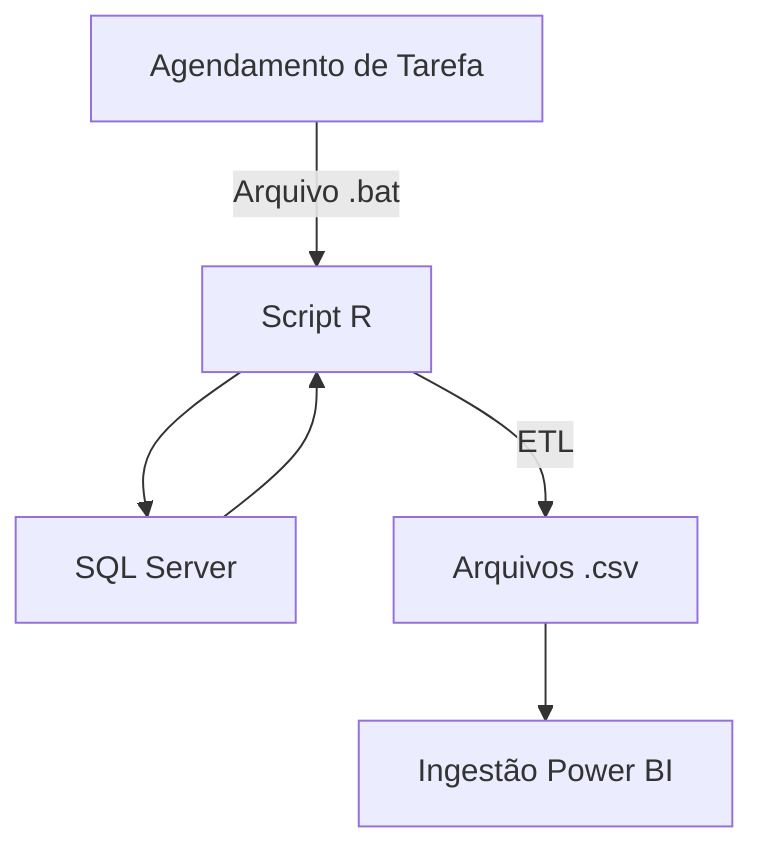

# bi-pipeline-zero-cost
Pipeline para ingestão em PowerBI Desktop

# 📊 BI Pipeline Zero Cost – SQL Server → R → Power BI Desktop

Este projeto demonstra a construção de um pipeline de Business Intelligence
automatizado, funcional e de **custo zero**, utilizando apenas ferramentas
open source e recursos já disponíveis em ambiente corporativo.

## 🚀 Visão Geral da Arquitetura

- **Agendamento**: Windows Task Scheduler
- **Extração**: Script em R
- **Fonte de dados**: SQL Server
- **Armazenamento intermediário**: Arquivos CSV
- **Camada analítica**: Power BI Desktop

### Diagrama

## ⏰ Orquestração

Um arquivo `.bat` é agendado para rodar diariamente às **03:00 da manhã**,
executando o script R responsável pela extração e geração dos dados.

## 📂 Dados Extraídos

- Descritivo de Vendas
- Contas a Receber e a Pagar
- Movimento Bancário

Cada conjunto é salvo em um CSV independente, permitindo flexibilidade
na modelagem dentro do Power BI.

## 🔐 Segurança

As credenciais e parâmetros sensíveis **não estão versionados**.
O projeto utiliza um arquivo de configuração externo (`config.yml`).

Veja `config/config.example.yml` como modelo.

## 🧰 Tecnologias Utilizadas

- R (DBI, odbc, tidyverse)
- SQL Server
- Windows Task Scheduler
- Power BI
- Git / GitHub

## 🎯 Objetivo do Projeto

Demonstrar:
- Automação de pipelines de dados
- Boas práticas de versionamento
- Separação de código e configuração
- Viabilidade de soluções BI com custo zero
